# Pion WebRTC 协议传输详细学习教程

> 适用对象：具备网络基础知识和 Linux 操作经验的开发者  
> 目标：深入理解 WebRTC 协议栈的传输层实现，能够进行协议调试和问题排查

---

## 目录

1. [第一章：WebRTC 协议栈全景](#第一章webrtc-协议栈全景)
2. [第二章：ICE - 建立网络连接](#第二章ice---建立网络连接)
3. [第三章：DTLS - 安全握手](#第三章dtls---安全握手)
4. [第四章：SCTP - 数据通道传输](#第四章sctp---数据通道传输)
5. [第五章：SRTP/SRTCP - 媒体安全传输](#第五章srtpsrtcp---媒体安全传输)
6. [第六章：多路复用与包分发](#第六章多路复用与包分发)
7. [第七章：SDP 与信令协商](#第七章sdp-与信令协商)
8. [第八章：高级主题与调试技巧](#第八章高级主题与调试技巧)

---

## 第一章：WebRTC 协议栈全景

### 1.1 WebRTC 协议分层架构

WebRTC 的协议栈是一个精心设计的分层架构，每一层都承担着特定的职责：

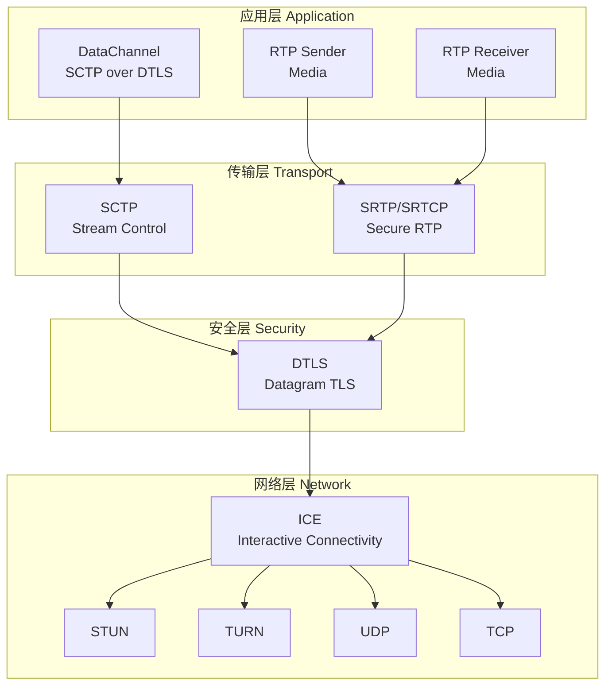

### 1.2 Pion WebRTC 核心组件关系

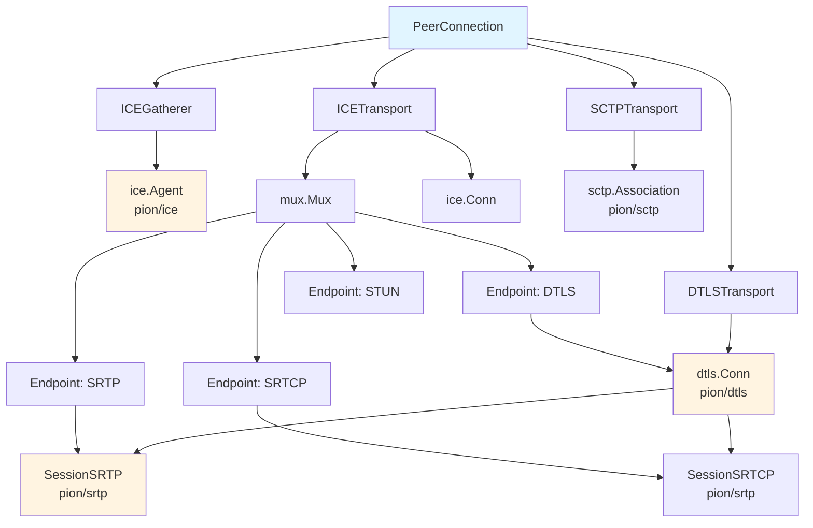

### 1.3 连接建立流程概览

一个完整的 WebRTC 连接建立过程如下：

```mermaid
sequenceDiagram
    participant A as Alice
    participant B as Bob
    
    Note over A: 1. Create PeerConnection<br/>2. AddTrack / CreateDataChannel
    
    A->>B: 3. CreateOffer<br/>(SDP with ICE ufrag/pwd)
    
    B->>B: 4. SetRemoteDescription
    B->>B: 5. ICE Gathering Starts
    B->>A: 6. CreateAnswer
    
    A->>A: 7. SetRemoteDescription
    
    rect rgb(230, 245, 255)
        Note over A,B: ICE Connectivity Phase
        A<->B: STUN Binding Requests
        A<->B: Candidate Pairs Testing
    end
    
    rect rgb(255, 245, 230)
        Note over A,B: DTLS Handshake Phase
        A<->B: ClientHello/ServerHello
        A<->B: Certificate Exchange
        A<->B: SRTP Key Derivation
    end
    
    rect rgb(230, 255, 230)
        Note over A,B: SCTP Association<br/>(DataChannel Only)
    end
    
    Note over A,B: Data/Media Flow Established
```

### 1.4 环境准备

#### 系统要求
- Linux/macOS/Windows 开发环境
- Go 1.21+ (推荐 1.22+)
- Wireshark (用于抓包分析)
- netcat, tcpdump 等网络工具

#### 安装依赖

```bash
# 克隆代码库
git clone https://github.com/pion/webrtc.git
cd webrtc

# 安装依赖
go mod download

# 验证安装
go test -v -run TestEmpty ./... 2>&1 | head -20
```

#### 网络调试工具准备

```bash
# Linux 安装调试工具
sudo apt-get update
sudo apt-get install -y wireshark tcpdump netcat-openbsd nmap

# macOS
brew install wireshark tcpdump netcat nmap

# 配置 Wireshark 解密 DTLS (需要 keylogfile)
# 编辑 ~/.wireshark/dtls-keys 文件
```

### 1.5 第一个实验：观察基础连接

**实验目标**：运行一个最简单的 Pion 示例，观察连接建立过程。

```bash
# 进入示例目录
cd examples/data-channels

# 查看代码结构
ls -la
# main.go  README.md  jsfiddle/

# 阅读代码重点关注：
# 1. PeerConnection 创建 (line 36)
# 2. ICE 服务器配置 (line 28-33)
# 3. DataChannel 回调 (line 68-98)
# 4. SDP 交换流程 (line 100-131)
```

**代码分析**:

```go
// 1. 配置 ICE 服务器
config := webrtc.Configuration{
    ICEServers: []webrtc.ICEServer{
        {
            URLs: []string{"stun:stun.l.google.com:19302"},
        },
    },
}

// 2. 创建 PeerConnection
peerConnection, err := webrtc.NewPeerConnection(config)

// 3. 状态监控
peerConnection.OnConnectionStateChange(func(state webrtc.PeerConnectionState) {
    fmt.Printf("State: %s\n", state.String())
    // 状态流转: New -> Connecting -> Connected -> Disconnected/Closed/Failed
})

// 4. DataChannel 事件
peerConnection.OnDataChannel(func(dc *webrtc.DataChannel) {
    dc.OnOpen(func() { ... })      // SCTP 关联建立
    dc.OnMessage(func(msg ...) { ... })  // 收到数据
})
```

**运行实验**:

```bash
# 终端 1：启动 Go 程序
go run main.go

# 程序会输出 SDP offer，格式为 base64
# 复制这段文本

# 打开浏览器，访问 https://jsfiddle.net/...
# 将 offer 粘贴到浏览器端

# 浏览器会生成 answer，复制回终端

# 观察连接建立过程
```

**预期输出分析**:

```
Peer Connection State has changed: connecting
# ICE 开始收集候选地址
# DTLS 开始握手
Peer Connection State has changed: connected
# 所有传输层就绪
Data channel '...' open.
# SCTP 关联建立
```

---

## 第二章：ICE - 建立网络连接

### 2.1 ICE 协议详解

ICE (Interactive Connectivity Establishment) 是 WebRTC 网络层的核心，负责在复杂的网络环境中找到可用的通信路径。

#### 2.1.1 ICE 核心概念

**Candidate（候选地址）**:
- **Host Candidate**: 本地网络接口的 IP:Port
- **Server Reflexive (srflx)**: 通过 STUN 服务器获取的公网映射地址
- **Relay (relay)**: TURN 服务器分配的中继地址
- **Peer Reflexive (prflx)**: 对端看到的地址（隐含）

**ICE 角色**:
- **Controlling**: 控制端，负责决定使用哪个候选对
- **Controlled**: 被控端，遵循控制端的决定

**ICE 流程**:

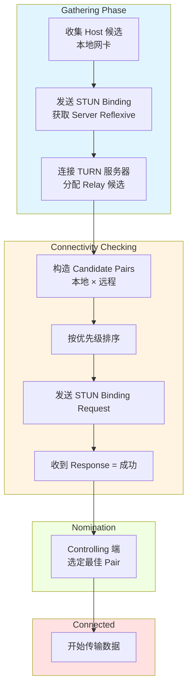

#### 2.1.2 ICE 相关 RFC

- **RFC 5245**: Interactive Connectivity Establishment (ICE)
- **RFC 8445**: ICE Candidate Gathering (更新版)
- **RFC 5389**: Session Traversal Utilities for NAT (STUN)
- **RFC 5766**: Traversal Using Relays around NAT (TURN)
- **RFC 5769**: STUN/TURN 测试向量

### 2.2 Pion ICE 实现架构

#### 2.2.1 核心结构体

```go
// ICEGatherer (icegatherer.go:25-52)
// 负责候选地址的收集和管理
type ICEGatherer struct {
    state ICEGathererState  // New, Gathering, Complete
    
    // ICE 服务器配置
    validatedServers []*stun.URI
    gatherPolicy     ICETransportPolicy  // all, relay, nohost
    
    // 底层 ICE Agent (来自 pion/ice 包)
    agent *ice.Agent
    
    // 候选地址池 (用于预收集)
    candidatePool        []ice.Candidate
    iceCandidatePoolSize uint8
}

// ICETransport (icetransport.go:24-44)
// 负责 ICE 连接的管理
type ICETransport struct {
    role ICERole  // Controlling, Controlled
    
    gatherer *ICEGatherer
    conn     *ice.Conn  // 已建立的 ICE 连接
    mux      *mux.Mux   // 多路复用器
}
```

#### 2.2.2 ICE Agent 创建流程

```go
// icegatherer.go:159-180
g.createAgent() {
    // 1. 构建 Agent 配置选项
    options := g.buildAgentOptions()
    
    // 2. 创建底层 ICE Agent
    agent, err := ice.NewAgentWithOptions(options...)
    
    // 3. 保存 Agent 引用
    g.agent = agent
}

// buildAgentOptions 详解 (icegatherer.go:182-209)
func (g *ICEGatherer) buildAgentOptions() ([]ice.AgentOption, error) {
    // 1. 确定候选类型限制
    candidateTypes := g.resolveCandidateTypes()
    // - relay 模式：只收集 Relay 候选
    // - nohost 模式：排除 Host 候选
    // - 默认：收集所有类型
    
    // 2. 基础配置
    options := []ice.AgentOption{
        ice.WithICELite(g.api.settingEngine.candidates.ICELite),
        ice.WithUrls(g.validatedServers),  // STUN/TURN 服务器
        ice.WithPortRange(minPort, maxPort),
        ice.WithNetworkTypes(...),  // UDP4, UDP6, TCP4, TCP6
    }
    
    // 3. 地址重写规则 (用于 NAT 1:1 映射)
    options = append(options, g.addressRewriteOptions(...))
    
    // 4. 超时配置
    options = append(options, g.timeoutOptions()...)
    
    return options, nil
}
```

### 2.3 实验：深入理解 ICE

#### 实验 2.1：观察候选地址收集

**实验代码** (`examples/trickle-ice/main.go`):

```go
package main

import (
    "fmt"
    "github.com/pion/webrtc/v4"
)

func main() {
    // 配置多个 ICE 服务器
    config := webrtc.Configuration{
        ICEServers: []webrtc.ICEServer{
            {URLs: []string{"stun:stun.l.google.com:19302"}},
            {URLs: []string{"stun:stun1.l.google.com:19302"}},
        },
    }
    
    pc, _ := webrtc.NewPeerConnection(config)
    
    // 监听候选地址收集事件
    pc.OnICECandidate(func(c *webrtc.ICECandidate) {
        if c != nil {
            fmt.Printf("New Candidate:\n")
            fmt.Printf("  Type: %s\n", c.Typ.String())      // host, srflx, relay, prflx
            fmt.Printf("  Protocol: %s\n", c.Protocol.String()) // udp, tcp
            fmt.Printf("  Address: %s:%d\n", c.Address, c.Port)
            fmt.Printf("  Priority: %d\n", c.Priority)
        }
    })
    
    // 创建 offer 触发 ICE 收集
    offer, _ := pc.CreateOffer(nil)
    pc.SetLocalDescription(offer)
    
    select {} // 阻塞等待
}
```

**运行与观察**:

```bash
go run trickle-ice/main.go

# 预期输出 (根据网络环境不同而变化):
New Candidate:
  Type: host
  Protocol: udp
  Address: 192.168.1.100:51842    # 本地网卡地址
  Priority: 2130706431

New Candidate:
  Type: srflx
  Protocol: udp  
  Address: 203.0.113.1:51842      # STUN 服务器看到的公网地址
  Priority: 1694498815

# 如果有 TURN 服务器，还会看到 relay 类型
```

**候选地址优先级计算** (RFC 5245 第 4.1.2 节):

```
priority = (2^24)*(type preference) + 
           (2^8)*(local preference) + 
           (2^0)*(256 - component ID)

type preference:
  - host:       126
  - prflx:      110  
  - srflx:      100
  - relay:      0
```

#### 实验 2.2：TCP ICE 连接

**实验目的**: 观察 WebRTC 在 TCP 模式下的连接建立

```bash
cd examples/ice-tcp

# 查看代码
# 注意 ICETransportPolicy 和 TCP 相关配置

# 运行
go run main.go
```

**关键配置**:

```go
// 设置引擎配置使用 TCP
settingEngine := webrtc.SettingEngine{}
// 配置 TCP 监听地址
settingEngine.SetNetworkTypes([]webrtc.NetworkType{
    webrtc.NetworkTypeTCP4,
    webrtc.NetworkTypeTCP6,
})

api := webrtc.NewAPI(webrtc.WithSettingEngine(settingEngine))
pc, _ := api.NewPeerConnection(config)
```

#### 实验 2.3：ICE 单端口模式

**实验目的**: 理解 ICE 单端口复用机制

```bash
cd examples/ice-single-port

# 这个示例展示如何让多个 PeerConnection 共享一个 UDP 端口
go run main.go
```

**核心原理** (`internal/mux/mux.go`):

```go
// 使用 demux 机制根据包内容分发到不同连接
type Mux struct {
    nextConn   net.Conn       // 共享的底层连接
    endpoints  map[*Endpoint]MatchFunc  // 端点映射表
}

// 根据第一个字节判断协议类型 (RFC 7983)
// [0-3]: STUN
// [20-63]: DTLS  
// [128-191]: RTP/RTCP
```

### 2.4 ICE 调试技巧

#### 2.4.1 启用详细日志

```go
// 设置日志级别
import "github.com/pion/logging"

loggingFactory := logging.NewDefaultLoggerFactory()
loggingFactory.DefaultLogLevel = logging.LogLevelDebug

settingEngine := webrtc.SettingEngine{}
settingEngine.SetLoggerFactory(loggingFactory)

api := webrtc.NewAPI(webrtc.WithSettingEngine(settingEngine))
```

#### 2.4.2 Wireshark 抓包分析

```bash
# 1. 找到 WebRTC 使用的端口
sudo tcpdump -i any -n -l | grep -E "(STUN|UDP)"

# 2. 抓取特定端口的 STUN 包
sudo tcpdump -i any -n 'port 19302' -w ice_stun.pcap

# 3. 在 Wireshark 中打开
# 过滤器: stun 或 ice
# 观察 Binding Request/Response
```

#### 2.4.3 常见问题排查

| 问题现象 | 可能原因 | 排查方法 |
|---------|---------|---------|
| 没有候选地址 | 网卡被禁用 | 检查 ICE network types |
| 只有 host 候选 | STUN 不可达 | 检查 STUN 服务器连通性 |
| ICE 失败 | NAT 类型不匹配 | 使用 TURN 服务器 |
| 连接超时 | 防火墙阻止 | 检查端口范围配置 |

---

## 第三章：DTLS - 安全握手

### 3.1 DTLS 协议基础

DTLS (Datagram Transport Layer Security) 是 TLS 的 UDP 版本，为 WebRTC 提供：
- **身份验证**: 基于证书的端点身份验证
- **加密**: 对称加密保护数据
- **完整性**: 消息认证码 (MAC) 防止篡改

#### 3.1.1 DTLS 握手流程

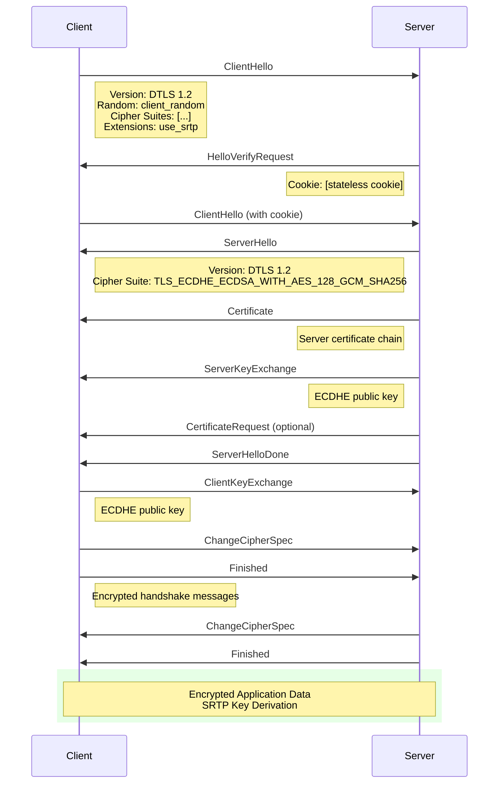

#### 3.1.2 WebRTC 中的 DTLS 特殊之处

1. **SRTP 密钥导出**: DTLS 握手成功后，导出 SRTP 加密密钥
2. **指纹验证**: 使用 SDP 中的 `a=fingerprint` 验证证书
3. **角色协商**: 与 ICE 角色关联，Controlling 端通常是 DTLS Server

### 3.2 Pion DTLS 实现详解

#### 3.2.1 DTLSTransport 结构

```go
// dtlsrole.go
const (
    DTLSRoleAuto   DTLSRole = iota  // 自动决定
    DTLSRoleClient                   // 客户端角色
    DTLSRoleServer                   // 服务器角色
)

// DTLSTransport (dtlstransport.go:37-61)
type DTLSTransport struct {
    iceTransport          *ICETransport    // 底层 ICE 传输
    certificates          []Certificate    // 本地证书
    remoteParameters      DTLSParameters   // 远程 DTLS 参数
    remoteCertificate     []byte           // 远程证书
    state                 DTLSTransportState
    srtpProtectionProfile srtp.ProtectionProfile
    
    conn *dtls.Conn  // 底层 DTLS 连接
    
    // SRTP/SRTCP 会话
    srtpSession, srtcpSession   atomic.Value
    srtpEndpoint, srtcpEndpoint *mux.Endpoint
    srtpReady                   chan struct{}  // SRTP 就绪信号
}
```

#### 3.2.2 DTLS 启动流程

```go
// DTLSTransport.Start (dtlstransport.go:304-338)
func (t *DTLSTransport) Start(remoteParameters DTLSParameters) error {
    // 1. 准备启动参数
    role, certificate, err := t.prepareStart(remoteParameters)
    
    // 2. 创建 DTLS 端点 (从 ICE 传输获取)
    dtlsEndpoint := t.iceTransport.newEndpoint(mux.MatchDTLS)
    
    // 3. 构建 DTLS 配置选项
    sharedOpts := t.dtlsSharedOptions(certificate)
    
    // 4. 建立 DTLS 连接 (Client 或 Server 模式)
    dtlsConn, err := t.connectDTLS(dtlsEndpoint, role, sharedOpts)
    
    // 5. 执行 DTLS 握手
    err = t.handshakeDTLS(dtlsConn)
    
    // 6. 完成启动，初始化 SRTP
    err = t.completeStart(dtlsConn)
    
    return nil
}

// connectDTLS 根据角色创建 Client 或 Server (dtlstransport.go:454-476)
func (t *DTLSTransport) connectDTLS(...) (*dtls.Conn, error) {
    if role == DTLSRoleClient {
        return dtls.ClientWithOptions(dtlsEndpoint, remoteAddr, clientOpts...)
    }
    return dtls.ServerWithOptions(dtlsEndpoint, remoteAddr, serverOpts...)
}
```

#### 3.2.3 SRTP 密钥导出

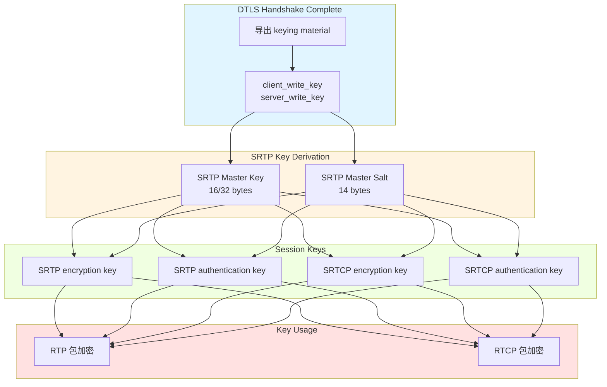

```go
// startSRTP (dtlstransport.go:195-258)
func (t *DTLSTransport) startSRTP() error {
    // 1. 创建 SRTP 配置
    srtpConfig := &srtp.Config{
        Profile: t.srtpProtectionProfile,
    }
    
    // 2. 从 DTLS 连接状态导出 SRTP 密钥
    connState, _ := t.conn.ConnectionState()
    err := srtpConfig.ExtractSessionKeysFromDTLS(&connState, t.role() == DTLSRoleClient)
    
    // 3. 创建 SRTP/SRTCP 会话
    srtpSession, err := srtp.NewSessionSRTP(t.srtpEndpoint, srtpConfig)
    srtcpSession, err := srtp.NewSessionSRTCP(t.srtcpEndpoint, srtpConfig)
    
    // 4. 保存会话
    t.srtpSession.Store(srtpSession)
    t.srtcpSession.Store(srtcpSession)
    close(t.srtpReady)  // 通知等待者 SRTP 已就绪
    
    return nil
}
```

#### 3.2.4 证书指纹验证

```go
// verifyPeerCertificateFunc (dtlstransport.go:431-451)
func (t *DTLSTransport) verifyPeerCertificateFunc() func([][]byte, [][]*x509.Certificate) error {
    return func(rawCerts [][]byte, _ [][]*x509.Certificate) error {
        // 1. 保存远程证书
        t.remoteCertificate = rawCerts[0]
        
        // 2. 如果禁用验证则跳过
        if t.api.settingEngine.disableCertificateFingerprintVerification {
            return nil
        }
        
        // 3. 解析证书
        parsedRemoteCert, err := x509.ParseCertificate(t.remoteCertificate)
        
        // 4. 验证指纹 (对比 SDP 中的 a=fingerprint)
        return t.validateFingerPrint(parsedRemoteCert)
    }
}

// validateFingerPrint 对比 SDP 中的指纹
func (t *DTLSTransport) validateFingerPrint(cert *x509.Certificate) error {
    for _, fp := range t.remoteParameters.Fingerprints {
        // 计算证书指纹
        hashFunc := fingerprint.HashAlgorithm(fp.Algorithm)
        calculated, _ := fingerprint.Fingerprint(cert, hashFunc)
        
        // 对比
        if calculated == fp.Value {
            return nil  // 验证通过
        }
    }
    return errInvalidFingerprint
}
```

### 3.3 实验：DTLS 深度分析

#### 实验 3.1：观察 DTLS 握手

**准备工作**:

```bash
# 设置 SSLKEYLOGFILE 环境变量解密 DTLS
cd examples/data-channels
SSLKEYLOGFILE=dtls_keys.log go run main.go

# 在另一个终端运行 Wireshark
wireshark -i any -f "udp portrange 10000-60000" -o "ssl.keylog_file:dtls_keys.log"
```

**代码添加日志**:

```go
// 启用 DTLS 详细日志
settingEngine := webrtc.SettingEngine{}
settingEngine.SetLoggerFactory(loggingFactory)

// 设置密钥日志写入器 (用于 Wireshark 解密)
keyLog, _ := os.Create("dtls_keys.log")
settingEngine.SetDTLSKeyLogWriter(keyLog)
```

#### 实验 3.2：自定义证书

```go
// certificate.go

// 生成 ECDSA P-256 证书
func generateCustomCertificate() (*webrtc.Certificate, error) {
    privateKey, err := ecdsa.GenerateKey(elliptic.P256(), rand.Reader)
    if err != nil {
        return nil, err
    }
    
    certificate, err := webrtc.GenerateCertificate(privateKey)
    return certificate, err
}

// 使用自定义证书创建 PeerConnection
config := webrtc.Configuration{
    ICEServers: []webrtc.ICEServer{...},
    Certificates: []webrtc.Certificate{*cert},
}
pc, err := webrtc.NewPeerConnection(config)
```

#### 实验 3.3：DTLS 角色控制

```go
// 强制指定 DTLS 角色
settingEngine := webrtc.SettingEngine{}
settingEngine.SetAnsweringDTLSRole(webrtc.DTLSRoleServer)
// 或
settingEngine.SetAnsweringDTLSRole(webrtc.DTLSRoleClient)

api := webrtc.NewAPI(webrtc.WithSettingEngine(settingEngine))
```

### 3.4 DTLS 常见问题

| 问题 | 原因 | 解决方案 |
|-----|------|---------|
| DTLS 握手超时 | 网络丢包严重 | 增加重传间隔 |
| 指纹验证失败 | SDP 指纹不匹配 | 检查信令传输 |
| 证书过期 | 证书超过有效期 | 重新生成证书 |
| SRTP 启动失败 | DTLS 未正常完成 | 检查 DTLS 状态 |

---

## 第四章：SCTP - 数据通道传输

### 4.1 SCTP 协议概述

SCTP (Stream Control Transmission Protocol) 是 WebRTC DataChannel 的传输协议，运行在 DTLS 之上。

#### 4.1.1 SCTP 关键特性

- **多流**: 一个关联可包含多个独立的数据流
- **有序/无序**: 每个流可配置为有序或无序传输
- **部分可靠**: 支持基于重传次数或超时时间的可靠性控制
- **拥塞控制**: 内置拥塞控制机制

#### 4.1.2 WebRTC DataChannel 配置

```go
// DataChannel 配置选项
dataChannel, err := pc.CreateDataChannel("label", &webrtc.DataChannelInit{
    Ordered:           boolPtr(true),      // 有序传输
    MaxPacketLifeTime: uint16Ptr(3000),    // 最大存活时间 (ms)
    MaxRetransmits:    uint16Ptr(5),       // 最大重传次数
    Protocol:          "json",             // 应用协议
    Negotiated:        false,              // 是否预协商
    ID:                uint16Ptr(0),       // 流 ID
})
```

**Channel Type 对应关系** (`datachannel.go:134-156`):

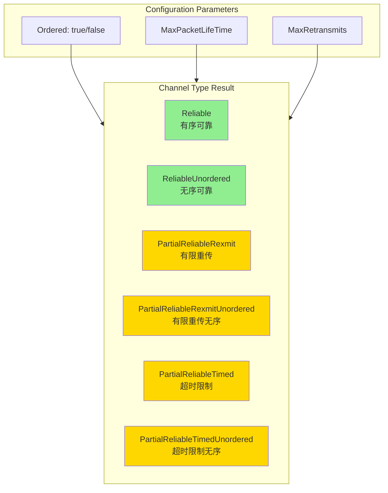

### 4.2 Pion SCTP 实现

#### 4.2.1 SCTPTransport 结构

```go
// SCTPTransport (sctptransport.go:24-58)
type SCTPTransport struct {
    dtlsTransport *DTLSTransport
    state         SCTPTransportState
    
    sctpAssociation *sctp.Association  // 底层 SCTP 关联
    
    // DataChannel 管理
    dataChannels          []*DataChannel
    dataChannelIDsUsed    map[uint16]struct{}
    dataChannelsOpened    uint32
}

// Start 启动 SCTP 传输 (sctptransport.go:100-158)
func (r *SCTPTransport) Start(capabilities SCTPCapabilities) error {
    // 1. 获取 DTLS 连接
    dtlsTransport := r.Transport()
    
    // 2. 创建 SCTP 关联 (Simultaneous Open 模式)
    sctpAssociation, err := sctp.Client(sctp.Config{
        NetConn:              dtlsTransport.conn,  // 运行在 DTLS 之上
        MaxReceiveBufferSize: r.api.settingEngine.sctp.maxReceiveBufferSize,
        EnableZeroChecksum:   r.api.settingEngine.sctp.enableZeroChecksum,
        MaxMessageSize:       maxMessageSize,
        MTU:                  outboundMTU,
    })
    
    // 3. 保存关联
    r.sctpAssociation = sctpAssociation
    r.state = SCTPTransportStateConnected
    
    // 4. 启动 DataChannel 接受协程
    go r.acceptDataChannels(sctpAssociation, dataChannels)
    
    return nil
}
```

#### 4.2.2 DataChannel 打开流程

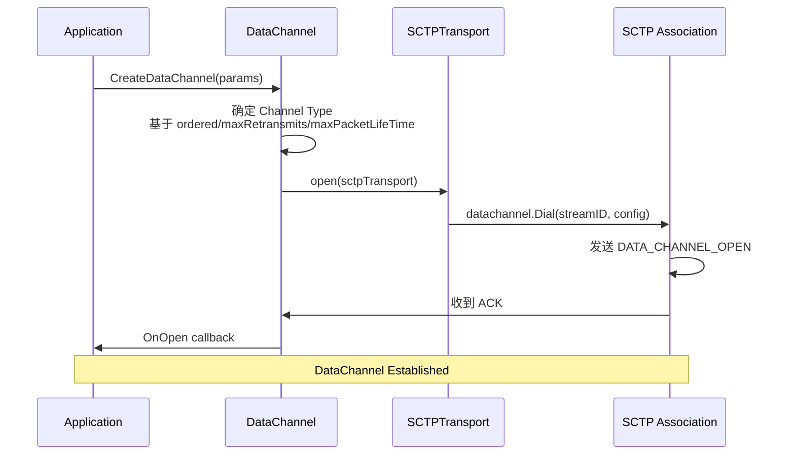

```go
// DataChannel.open (datachannel.go:118-195)
func (d *DataChannel) open(sctpTransport *SCTPTransport) error {
    association := sctpTransport.association()
    
    // 1. 确定 Channel Type
    var channelType datachannel.ChannelType
    var reliabilityParameter uint32
    
    switch {
    case d.maxPacketLifeTime == nil && d.maxRetransmits == nil:
        if d.ordered {
            channelType = datachannel.ChannelTypeReliable
        } else {
            channelType = datachannel.ChannelTypeReliableUnordered
        }
    // ... 其他情况
    }
    
    // 2. 构建配置
    cfg := &datachannel.Config{
        ChannelType:          channelType,
        ReliabilityParameter: reliabilityParameter,
        Label:                d.label,
        Protocol:             d.protocol,
        Negotiated:           d.negotiated,
    }
    
    // 3. 分配流 ID
    if d.id == nil {
        d.sctpTransport.generateAndSetDataChannelID(...)
    }
    
    // 4. 创建 DataChannel
    dc, err := datachannel.Dial(association, *d.id, cfg)
    
    // 5. 处理打开
    d.handleOpen(dc, false, d.negotiated)
    
    return nil
}
```

### 4.3 实验：SCTP 深入分析

#### 实验 4.1：DataChannel 模式对比

```go
package main

import (
    "fmt"
    "time"
    "github.com/pion/webrtc/v4"
)

func main() {
    // 创建不同类型的 DataChannel
    configs := []struct {
        name     string
        init     *webrtc.DataChannelInit
        expected string
    }{
        {
            name: "可靠有序",
            init: &webrtc.DataChannelInit{
                Ordered: boolPtr(true),
            },
            expected: "ChannelTypeReliable",
        },
        {
            name: "可靠无序",
            init: &webrtc.DataChannelInit{
                Ordered: boolPtr(false),
            },
            expected: "ChannelTypeReliableUnordered",
        },
        {
            name: "部分可靠(重传限制)",
            init: &webrtc.DataChannelInit{
                MaxRetransmits: uint16Ptr(3),
            },
            expected: "ChannelTypePartialReliableRexmit",
        },
        {
            name: "部分可靠(超时限制)",
            init: &webrtc.DataChannelInit{
                MaxPacketLifeTime: uint16Ptr(1000),
            },
            expected: "ChannelTypePartialReliableTimed",
        },
    }
    
    for _, cfg := range configs {
        fmt.Printf("\n=== %s ===\n", cfg.name)
        pc, _ := webrtc.NewPeerConnection(webrtc.Configuration{})
        
        dc, _ := pc.CreateDataChannel("test", cfg.init)
        
        dc.OnOpen(func() {
            fmt.Printf("DataChannel opened\n")
            // 发送测试数据
            for i := 0; i < 5; i++ {
                dc.SendText(fmt.Sprintf("Message %d", i))
                time.Sleep(100 * time.Millisecond)
            }
        })
        
        dc.OnMessage(func(msg webrtc.DataChannelMessage) {
            fmt.Printf("Received: %s\n", string(msg.Data))
        })
    }
}
```

#### 实验 4.2：DataChannel 流控制

```bash
cd examples/data-channels-flow-control

# 这个示例展示了如何使用 BufferedAmount 进行流量控制
go run main.go
```

**核心代码**:

```go
// 监控缓冲区
var totalSent, totalReceived int64

dc.OnBufferedAmountLow(func() {
    // 缓冲区低于阈值，可以继续发送
    sendMoreData()
})

// 设置阈值
dc.SetBufferedAmountLowThreshold(1024 * 1024) // 1MB
```

#### 实验 4.3：Detach 模式 (直接 SCTP 访问)

```bash
cd examples/data-channels-detach

# 使用 datachannel.ReadWriteCloser 接口直接操作
go run main.go
```

**Detach 模式代码**:

```go
// 启用 Detach 模式
settingEngine := webrtc.SettingEngine{}
settingEngine.DetachDataChannels()

api := webrtc.NewAPI(webrtc.WithSettingEngine(settingEngine))
pc, _ := api.NewPeerConnection(config)

dc, _ := pc.CreateDataChannel("detached", nil)

dc.OnOpen(func() {
    // 获取底层 datachannel
    d, err := dc.Detach()
    if err != nil {
        panic(err)
    }
    
    // 使用 io.ReadWriteCloser 接口
    go func() {
        buf := make([]byte, 1500)
        for {
            n, err := d.Read(buf)
            if err != nil {
                return
            }
            fmt.Printf("Read %d bytes\n", n)
        }
    }()
})
```

---

## 第五章：SRTP/SRTCP - 媒体安全传输

### 5.1 SRTP 协议基础

SRTP (Secure Real-time Transport Protocol) 为 RTP 媒体流提供加密和认证。

#### 5.1.1 SRTP 密钥管理

WebRTC 使用 DTLS 进行密钥交换（DTLS-SRTP 模式）：

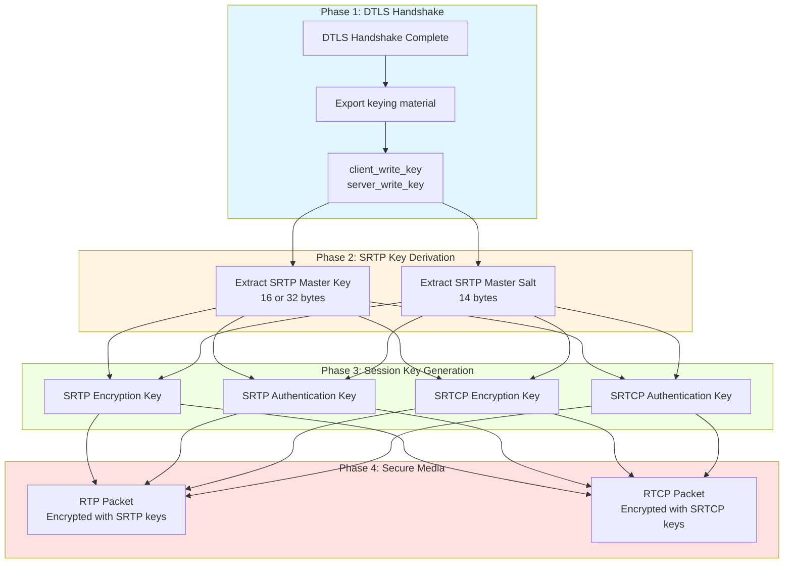

#### 5.1.2 SRTP Protection Profiles

```go
// 支持的 SRTP 保护配置 (dtlstransport.go:423-429)
func defaultSrtpProtectionProfiles() []dtls.SRTPProtectionProfile {
    return []dtls.SRTPProtectionProfile{
        dtls.SRTP_AEAD_AES_256_GCM,        // 首选: AEAD AES-256-GCM
        dtls.SRTP_AES128_CM_HMAC_SHA1_80,  // 兼容: AES-CM + HMAC-SHA1
    }
}
```

### 5.2 Pion SRTP 实现

#### 5.2.1 SRTP 会话管理

```go
// DTLSTransport 中的 SRTP 相关字段 (dtlstransport.go:52-56)
type DTLSTransport struct {
    srtpSession, srtcpSession   atomic.Value  // 懒加载存储
    srtpEndpoint, srtcpEndpoint *mux.Endpoint // 多路复用端点
    srtpReady                   chan struct{} // 就绪信号
}

// 获取 SRTP 会话 (dtlstransport.go:260-274)
func (t *DTLSTransport) getSRTPSession() (*srtp.SessionSRTP, error) {
    if value, ok := t.srtpSession.Load().(*srtp.SessionSRTP); ok {
        return value, nil
    }
    return nil, errDtlsTransportNotStarted
}
```

#### 5.2.2 RTP Sender/Receiver

```go
// RTPSender (rtpsender.go:36-58)
type RTPSender struct {
    trackEncodings []*trackEncoding
    transport      *DTLSTransport
    
    payloadType PayloadType
    kind        RTPCodecType
}

// RTPReceiver (rtpreceiver.go:62-80)
type RTPReceiver struct {
    kind      RTPCodecType
    transport *DTLSTransport
    
    tracks []trackStreams
}

// trackStreams (rtpreceiver.go:28-45)
type trackStreams struct {
    track *TrackRemote
    
    rtpReadStream   *srtp.ReadStreamSRTP
    rtcpReadStream  *srtp.ReadStreamSRTCP
    
    // RTX (重传) 流
    repairReadStream    *srtp.ReadStreamSRTP
    repairRtcpReadStream *srtp.ReadStreamSRTCP
}
```

#### 5.2.3 读流创建流程

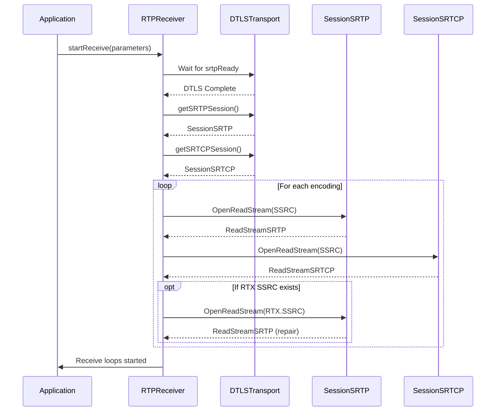

```go
// rtpreceiver.go: 读取 RTP 包流程

// 1. 创建 SRTP 读流
func (r *RTPReceiver) startReceive(parameters RTPReceiveParameters) error {
    // 等待 DTLS 就绪
    <-r.transport.srtpReady
    
    // 获取 SRTP 会话
    srtpSession, _ := r.transport.getSRTPSession()
    
    // 为每个 SSRC 创建读流
    for _, encoding := range parameters.Encodings {
        // 创建 SRTP 读流
        rtpStream, err := srtpSession.OpenReadStream(uint32(encoding.SSRC))
        
        // 创建 SRTCP 读流
        rtcpStream, err := srtcpSession.OpenReadStream(uint32(encoding.SSRC))
        
        // 如果有 RTX SSRC，创建修复流
        if encoding.RTX.SSRC != 0 {
            repairStream, _ := srtpSession.OpenReadStream(uint32(encoding.RTX.SSRC))
        }
    }
}
```

### 5.3 实验：SRTP 分析

#### 实验 5.1：RTP 包转发

```bash
cd examples/rtp-forwarder
go run main.go

# 这个示例接收 WebRTC 流并转发为裸 RTP 包
```

**核心代码**:

```go
// 从 Track 读取 RTP 包
track, _ := pc.NewTrack(...)

for {
    // 读取 RTP 包
    packet, _, err := track.ReadRTP()
    if err != nil {
        return
    }
    
    // 序列化并转发
    raw, _ := packet.Marshal()
    udpConn.Write(raw)
}
```

#### 实验 5.2：RTCP 处理

```bash
cd examples/rtcp-processing
go run main.go
```

**RTCP 包处理**:

```go
// 接收 RTCP 包
rtcpReader, _ := receiver.ReadRTCP()

for {
    packets, _, err := rtcpReader.Read()
    if err != nil {
        return
    }
    
    for _, packet := range packets {
        switch p := packet.(type) {
        case *rtcp.ReceiverReport:
            // 处理接收报告
            for _, report := range p.Reports {
                fmt.Printf("SSRC: %d, Loss: %d%%\n", 
                    report.SSRC, report.FractionLost*100/255)
            }
        case *rtcp.PictureLossIndication:
            // 处理 PLI (关键帧请求)
            fmt.Printf("PLI received for SSRC %d\n", p.MediaSSRC)
        }
    }
}
```

#### 实验 5.3：SRTP 密钥导出验证

```go
package main

import (
    "crypto/tls"
    "fmt"
    "github.com/pion/dtls/v3"
    "github.com/pion/srtp/v3"
)

func main() {
    // 设置密钥日志
    keyLog, _ := os.Create("srtp_keys.log")
    
    // 配置 DTLS 连接
    config := &dtls.Config{
        SRTPProtectionProfiles: []dtls.SRTPProtectionProfile{
            dtls.SRTP_AES128_CM_HMAC_SHA1_80,
        },
        KeyLogWriter: keyLog,
    }
    
    // 连接后导出密钥
    conn, _ := dtls.Dial("udp", addr, config)
    
    state, _ := conn.ConnectionState()
    
    // 导出 SRTP 密钥
    srtpConfig := &srtp.Config{
        Profile: srtp.ProtectionProfileAes128CmHmacSha1_80,
    }
    
    err := srtpConfig.ExtractSessionKeysFromDTLS(&state, true)
    if err != nil {
        panic(err)
    }
    
    fmt.Printf("SRTP keys extracted successfully\n")
}
```

---

## 第六章：多路复用与包分发

### 6.1 RFC 7983 多路复用

WebRTC 在单个 UDP 端口上同时传输多种协议，通过第一个字节区分：

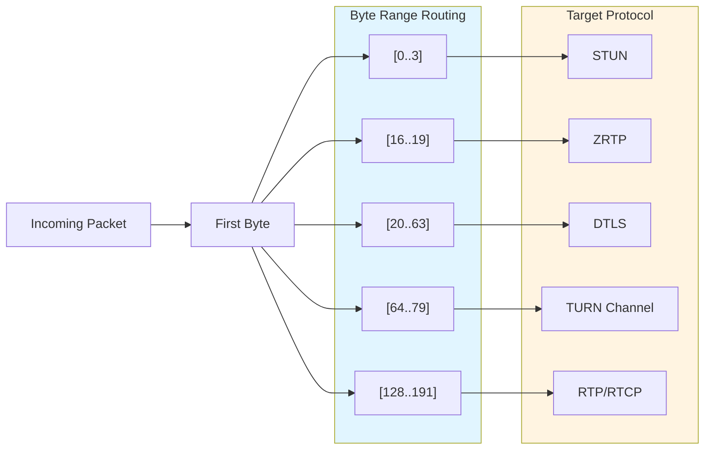

### 6.2 Pion Mux 实现

#### 6.2.1 Mux 结构

```go
// internal/mux/mux.go:35-46
type Mux struct {
    nextConn   net.Conn       // 底层 ICE 连接
    bufferSize int
    lock       sync.Mutex
    endpoints  map[*Endpoint]MatchFunc  // 端点注册表
    isClosed   bool
    
    pendingPackets [][]byte  // 待处理包队列
}
```

#### 6.2.2 包分发逻辑

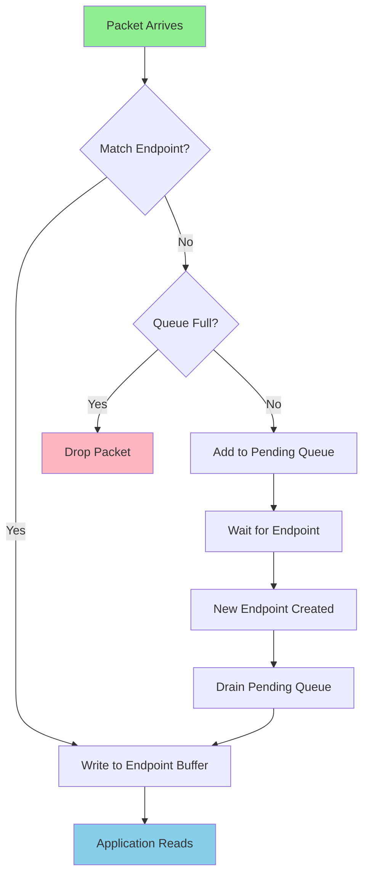

```go
// internal/mux/mux.go:148-199
func (m *Mux) dispatch(buf []byte) error {
    // 1. 遍历所有端点，找到匹配的
    m.lock.Lock()
    for e, f := range m.endpoints {
        if f(buf) {  // 使用 MatchFunc 判断
            endpoint = e
            break
        }
    }
    
    // 2. 如果找到匹配端点，写入其缓冲区
    if endpoint != nil {
        m.lock.Unlock()
        _, err := endpoint.buffer.Write(buf)
        return err
    }
    
    // 3. 如果没有匹配，加入待处理队列
    if !m.isClosed && len(m.pendingPackets) < maxPendingPackets {
        m.pendingPackets = append(m.pendingPackets, append([]byte{}, buf...))
    }
    
    m.lock.Unlock()
    return nil
}
```

#### 6.2.3 协议匹配函数

```go
// internal/mux/muxfunc.go

// MatchDTLS: 匹配 DTLS 包 (第一个字节 20-63)
func MatchDTLS(b []byte) bool {
    return MatchRange(20, 63, b)
}

// MatchSRTPOrSRTCP: 匹配 RTP/RTCP 包 (第一个字节 128-191)
func MatchSRTPOrSRTCP(b []byte) bool {
    return MatchRange(128, 191, b)
}

// MatchSRTCP: 仅匹配 RTCP (第二个字节 192-223)
func MatchSRTCP(buf []byte) bool {
    return MatchSRTPOrSRTCP(buf) && isRTCP(buf)
}

func isRTCP(buf []byte) bool {
    if len(buf) < 4 {
        return false
    }
    return buf[1] >= 192 && buf[1] <= 223
}

// MatchSRTP: 仅匹配 RTP (排除 RTCP)
func MatchSRTP(buf []byte) bool {
    return MatchSRTPOrSRTCP(buf) && !isRTCP(buf)
}
```

#### 6.2.4 Endpoint 实现

```go
// internal/mux/endpoint.go:17-21
type Endpoint struct {
    mux     *Mux
    buffer  *packetio.Buffer  // 包缓冲区
    onClose func()
}

// Endpoint 实现 net.Conn 接口
func (e *Endpoint) Read(p []byte) (int, error) {
    return e.buffer.Read(p)  // 从缓冲区读取
}

func (e *Endpoint) Write(p []byte) (int, error) {
    // 写回底层连接
    return e.mux.nextConn.Write(p)
}
```

### 6.3 实验：Mux 分析

#### 实验 6.1：自定义 Mux 匹配

```go
package main

import (
    "github.com/pion/webrtc/v4/internal/mux"
)

func main() {
    // 创建自定义匹配函数
    matchCustomProtocol := func(buf []byte) bool {
        // 匹配特定协议标识
        return len(buf) > 4 && 
               buf[0] == 0xFF && 
               buf[1] == 0xAA
    }
    
    // 配置 ICE 传输使用自定义 mux
    settingEngine := webrtc.SettingEngine{}
    // ...
}
```

#### 实验 6.2：观察包分发

```go
// 添加日志观察包分发
func (m *Mux) dispatchWithLogging(buf []byte) error {
    if len(buf) > 0 {
        log.Printf("[MUX] Received packet, first byte: %d (0x%02X)", 
            buf[0], buf[0])
        
        // 判断协议类型
        switch {
        case buf[0] >= 0 && buf[0] <= 3:
            log.Println("[MUX] -> STUN packet")
        case buf[0] >= 20 && buf[0] <= 63:
            log.Println("[MUX] -> DTLS packet")
        case buf[0] >= 128 && buf[0] <= 191:
            if len(buf) > 1 && buf[1] >= 192 && buf[1] <= 223 {
                log.Println("[MUX] -> RTCP packet")
            } else {
                log.Println("[MUX] -> RTP packet")
            }
        default:
            log.Println("[MUX] -> Unknown packet type")
        }
    }
    
    return m.dispatch(buf)
}
```

---

## 第七章：SDP 与信令协商

### 7.1 SDP 协议基础

SDP (Session Description Protocol) 描述多媒体会话的参数。

#### 7.1.1 WebRTC SDP 结构

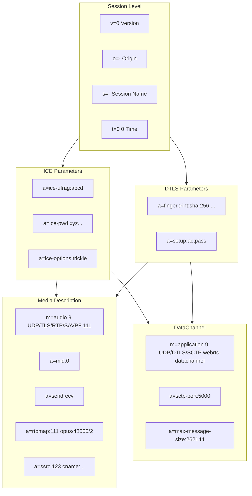

### 7.2 Pion SDP 处理

#### 7.2.1 SDP 解析与生成

```go
// sdp.go:77-200
func trackDetailsFromSDP(
    log logging.LeveledLogger,
    s *sdp.SessionDescription,
) (incomingTracks []trackDetails) {
    for _, media := range s.MediaDescriptions {
        // 1. 提取 MID
        midValue := getMidValue(media)
        
        // 2. 提取 SSRC 信息
        for _, attr := range media.Attributes {
            switch attr.Key {
            case sdp.AttrKeySSRC:
                // 解析 SSRC
                ssrc, _ := strconv.ParseUint(split[0], 10, 32)
                
            case sdp.AttrKeySSRCGroup:
                // 解析 SSRC Group (FID for RTX)
                if split[0] == sdp.SemanticTokenFlowIdentification {
                    // RTX 修复流映射
                    rtxRepairFlows[rtxSSRC] = baseSSRC
                }
            }
        }
    }
}
```

#### 7.2.2 ICE 参数提取

```go
// 从 SDP 提取 ICE 详情
func extractICEDetails(desc *sdp.SessionDescription, log logging.LeveledLogger) (
    *iceDetails, error,
) {
    // 提取 ice-ufrag 和 ice-pwd
    ufrag, _ := desc.Attribute("ice-ufrag")
    pwd, _ := desc.Attribute("ice-pwd")
    
    // 提取候选地址
    var candidates []*ICECandidate
    for _, m := range desc.MediaDescriptions {
        for _, a := range m.Attributes {
            if a.Key == "candidate" {
                candidate, _ := UnmarshalICECandidate(a.Value)
                candidates = append(candidates, candidate)
            }
        }
    }
    
    return &iceDetails{
        Ufrag:      ufrag,
        Password:   pwd,
        Candidates: candidates,
    }, nil
}
```

### 7.3 信令状态机

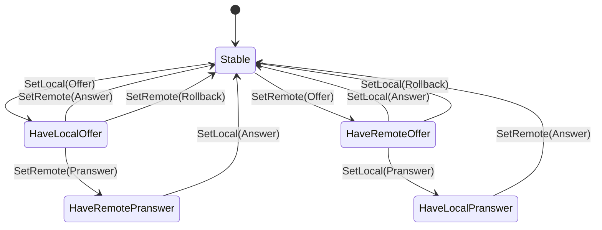

```go
// signalingstate.go

// SignalingState 定义
type SignalingState int

const (
    SignalingStateStable SignalingState = iota
    SignalingStateHaveLocalOffer
    SignalingStateHaveRemoteOffer
    SignalingStateHaveLocalPranswer
    SignalingStateHaveRemotePranswer
)

// 状态转换表 (peerconnection.go:970-1084)
//              Current State          | Operation        | New State
// -------------------------------------|------------------|------------------
// stable                               | SetLocal(Offer)  | have-local-offer
// stable                               | SetRemote(Offer) | have-remote-offer
// have-local-offer                     | SetRemote(Answer)| stable
// have-remote-offer                    | SetLocal(Answer) | stable
```

### 7.4 实验：SDP 操作

#### 实验 7.1：手动 SDP 交换

```bash
cd examples/ortc

# 这个示例展示如何使用 ORTC API 手动进行协商
go run main.go
```

**手动协商代码**:

```go
// 创建独立传输层
iceGatherer := api.NewICEGatherer(...)
iceTransport := api.NewICETransport(iceGatherer)
dtlsTransport := api.NewDTLSTransport(iceTransport, ...)
sctpTransport := api.NewSCTPTransport(dtlsTransport)

// 手动交换参数 (不使用 SDP)
localICEParams := iceTransport.GetLocalParameters()
localDTLSParams := dtlsTransport.GetLocalParameters()

// 通过网络发送给对方
sendToPeer(localICEParams, localDTLSParams)

// 接收对方参数
remoteICEParams := receiveFromPeer()
remoteDTLSParams := receiveFromPeer()

// 启动传输
iceTransport.Start(nil, remoteICEParams, &role)
dtlsTransport.Start(remoteDTLSParams)
sctpTransport.Start(SCTPCapabilities{...})
```

#### 实验 7.2：SDP 修改与注入

```go
// 修改 SDP 后再设置
offer, _ := pc.CreateOffer(nil)

// 解析 SDP
parsed := &sdp.SessionDescription{}
parsed.UnmarshalString(offer.SDP)

// 修改 (例如: 强制使用特定编解码)
for _, m := range parsed.MediaDescriptions {
    if m.MediaName.Media == "video" {
        // 只保留 VP8
        m.MediaName.Formats = []string{"96"}
        m.Attributes = filterAttributes(m.Attributes, "rtpmap:96")
    }
}

// 重新序列化
modifiedSDP, _ := parsed.MarshalString()
offer.SDP = modifiedSDP

pc.SetLocalDescription(offer)
```

---

## 第八章：高级主题与调试技巧

### 8.1 连接状态监控

```go
// 监控所有关键状态
pc.OnICEConnectionStateChange(func(state webrtc.ICEConnectionState) {
    fmt.Printf("ICE State: %s\n", state.String())
    // New -> Checking -> Connected -> Completed -> Disconnected -> Closed
})

pc.OnConnectionStateChange(func(state webrtc.PeerConnectionState) {
    fmt.Printf("PC State: %s\n", state.String())
    // New -> Connecting -> Connected -> Disconnected/Failed/Closed
})

pc.OnSignalingStateChange(func(state webrtc.SignalingState) {
    fmt.Printf("Signaling State: %s\n", state.String())
    // Stable -> HaveLocalOffer -> HaveRemoteAnswer -> Stable
})

// 监控 ICE 候选对
iceTransport.OnSelectedCandidatePairChange(func(pair *webrtc.ICECandidatePair) {
    fmt.Printf("Selected pair: %s <-> %s\n",
        pair.Local.String(), pair.Remote.String())
})
```

### 8.2 性能调优

#### 8.2.1 ICE 调优

```go
settingEngine := webrtc.SettingEngine{}

// 设置端口范围
settingEngine.SetEphemeralUDPPortRange(10000, 20000)

// 设置网络类型 (排除 IPv6)
settingEngine.SetNetworkTypes([]webrtc.NetworkType{
    webrtc.NetworkTypeUDP4,
    webrtc.NetworkTypeTCP4,
})

// ICE Lite 模式 (公网服务器)
settingEngine.SetICELite(true)

// NAT 1:1 映射 (已知公网 IP)
settingEngine.SetNAT1To1IPs([]string{"203.0.113.1"}, webrtc.ICECandidateTypeHost)
```

#### 8.2.2 SRTP 调优

```go
// 禁用重放保护 (测试环境)
settingEngine.DisableSRTPReplayProtection(true)

// 设置接收 MTU
settingEngine.SetReceiveMTU(1500)
```

#### 8.2.3 SCTP 调优

```go
// 设置接收缓冲区
settingEngine.SetSCTPMaxReceiveBufferSize(1024 * 1024) // 1MB

// 启用零校验和 (性能优化)
settingEngine.SetSCTPEnableZeroChecksum(true)
```

### 8.3 调试工具链

#### 8.3.1 日志级别设置

```go
import "github.com/pion/logging"

// 自定义日志输出
loggingFactory := &logging.DefaultLoggerFactory{
    Writer:          os.Stdout,
    DefaultLogLevel: logging.LogLevelDebug,
}

// 为特定组件设置日志
loggingFactory.SetLogLevel("ice", logging.LogLevelTrace)
loggingFactory.SetLogLevel("dtls", logging.LogLevelDebug)
loggingFactory.SetLogLevel("srtp", logging.LogLevelWarn)

settingEngine.SetLoggerFactory(loggingFactory)
```

#### 8.3.2 统计信息

```go
// 获取统计信息
stats := pc.GetStats()

for _, s := range stats {
    switch stat := s.(type) {
    case webrtc.ICECandidatePairStats:
        fmt.Printf("Candidate Pair: %s\n", stat.LocalCandidateID)
        fmt.Printf("  Bytes Sent: %d\n", stat.BytesSent)
        fmt.Printf("  Bytes Received: %d\n", stat.BytesReceived)
        fmt.Printf("  Current Round Trip Time: %f\n", stat.CurrentRoundTripTime)
        
    case webrtc.InboundRTPStreamStats:
        fmt.Printf("Inbound RTP: SSRC=%d\n", stat.SSRC)
        fmt.Printf("  Packets Received: %d\n", stat.PacketsReceived)
        fmt.Printf("  Packets Lost: %d\n", stat.PacketsLost)
        fmt.Printf("  Jitter: %f\n", stat.Jitter)
    }
}
```

#### 8.3.3 Wireshark 完整调试流程

```bash
# 1. 启动程序并导出密钥
SSLKEYLOGFILE=/tmp/webrtc_keys.log go run main.go

# 2. 抓包 (macOS)
sudo tcpdump -i any -s 0 -w /tmp/webrtc.pcap 'udp portrange 10000-60000 or tcp portrange 10000-60000'

# 3. 在 Wireshark 中分析
# - 设置 SSLKEYLOGFILE: Edit -> Preferences -> Protocols -> TLS -> (Pre)-Master-Secret log filename
# - 过滤器: dtls || srtp || stun || ice
# - 查看 SRTP 解密后的 RTP 包
```

### 8.4 常见问题排查

| 问题 | 排查步骤 | 解决方案 |
|-----|---------|---------|
| ICE 连接失败 | 1. 检查候选地址收集<br>2. 查看 STUN/TURN 连通性<br>3. 检查防火墙 | 配置 TURN 服务器<br>使用 ICE TCP |
| DTLS 握手失败 | 1. 检查指纹匹配<br>2. 查看证书有效期<br>3. 抓包分析握手 | 同步时钟<br>重新生成证书 |
| 媒体传输失败 | 1. 检查 SRTP 启动<br>2. 查看 SSRC 匹配<br>3. 检查编解码协商 | 确认 SDP 正确<br>检查 SSRC 映射 |
| DataChannel 失败 | 1. 检查 SCTP 关联<br>2. 查看 DTLS 状态<br>3. 检查流 ID 分配 | 等待 DTLS 完成<br>手动指定流 ID |

### 8.5 推荐学习资源

#### RFC 文档
1. **RFC 8829** - JavaScript Session Establishment Protocol (JSEP)
2. **RFC 8838** - Trickle ICE
3. **RFC 8839** - SDP ICE Parameters
4. **RFC 8840** - DTLS-SRTP
5. **RFC 8841** - DTLS-SCTP
6. **RFC 8832** - WebRTC DataChannel

#### 书籍
- [WebRTC for the Curious](https://webrtcforthecurious.com) - 深度技术详解
- [Real-Time Communication with WebRTC](https://www.informit.com/store/real-time-communication-with-webrtc-9780134094356)

#### 工具
- [WebRTC Internals Dump Analyzer](https://webrtc-internals.info/)
- [WebRTC Troubleshooter](https://test.webrtc.org/)

---

## 附录：实验检查清单

### 基础实验
- [ ] 运行 data-channels 示例
- [ ] 观察 ICE 候选收集
- [ ] 使用 Wireshark 抓包分析

### 中级实验
- [ ] 实现自定义信令
- [ ] 配置 TURN 服务器
- [ ] 使用 Detach 模式

### 高级实验
- [ ] 实现自定义 SRTP 处理
- [ ] 性能调优与测试
- [ ] 多 PeerConnection 管理

---

**学习建议**：每个章节建议用时 1-2 周，理论和实践结合，多做实验加深理解。
